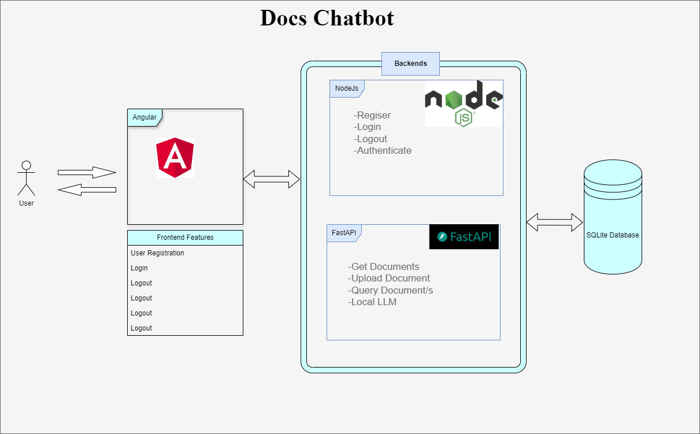

# Docs-Chatbot 

## Why did we make this? 🚰

This will be a great boilerplate, if you are planning for Angular Frontend, with backend authentication been done in NodeJs using and another backend in fast api, where llm is run locally and do upload documents and send prompts to llm, which will use the current user's selected documents and give response.

## Product Features 🛃 
* User Login
* Regiser User
* Logout
* Documents upload
* Prompt the LLM using the selected documents and get response

## Development Features ➿

* No need of external AWS, LLM endpoint, and separately running database.
* Just build and run three projects:
	* Frontend (UI)
	* Backend-NodeJs (AAA)
	* Backend-FastAPI (LLM, Documents Management, and Handles Prompts)

## Tech Stack 🚰
- Frontend
	- Angular 17
	- Bootstrap 5
- Backend
    * FastAPI
		+ SQLModel built on top of SQLAlchemy
		+ Sentence Transformers
		+ Embeddings
		+ Locally Run and Lightweight LLM (not for accuracy but for a live LLM response)
		+ Swagger (FastAPI serves the Swagger UI directly from its built-in components)
    * NodeJs
		+ Express
		+ MVC Pattern
			* Model
			* Controller
			* Response (View)
		+ JavaScript
		+ jsonwebtoken
		+ Swagger
	* SQLite
	    + You can view the data using any tools like DB Browser, if you want see the tables and data by opening the database.sqlite file inside `database` folder.

## System Architecture 🚰

## Usage ➿
See `README.md` files in `frontend/`, `backend-fastapi/` & `backend-nodejs/` folders for individual setup and running instructions for each.

You can view the data using any tools like `DB Browser`, if you want see the tables and data by opening the `database.sqlite` file inside `database` folder.

## The compatible node, npm and python versions as per codespace ➿
node v20.15.1 or compatible
npm 10.7.0 or compatible
Python 3.10.11 or compatible

You may need to upgrade node, npm & python to avoid any package installation errors.