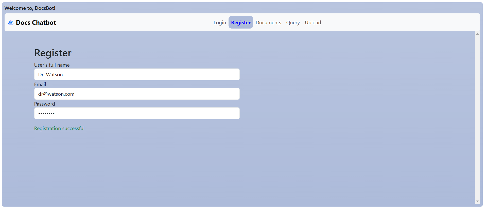
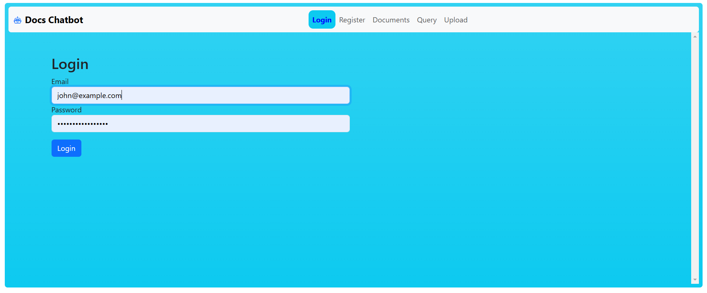
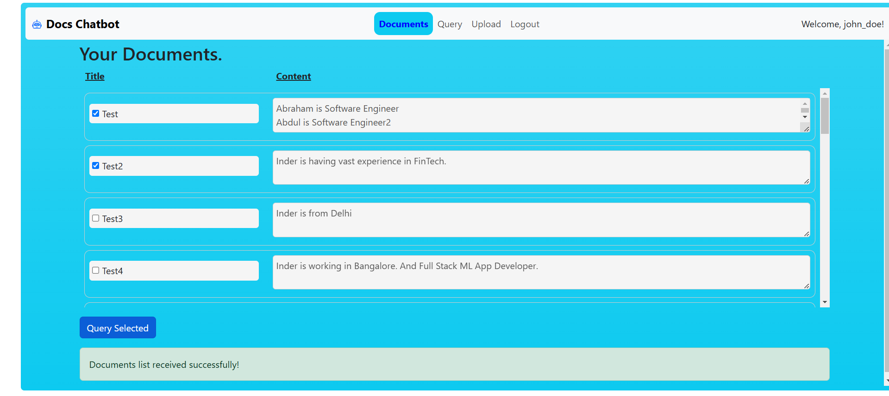
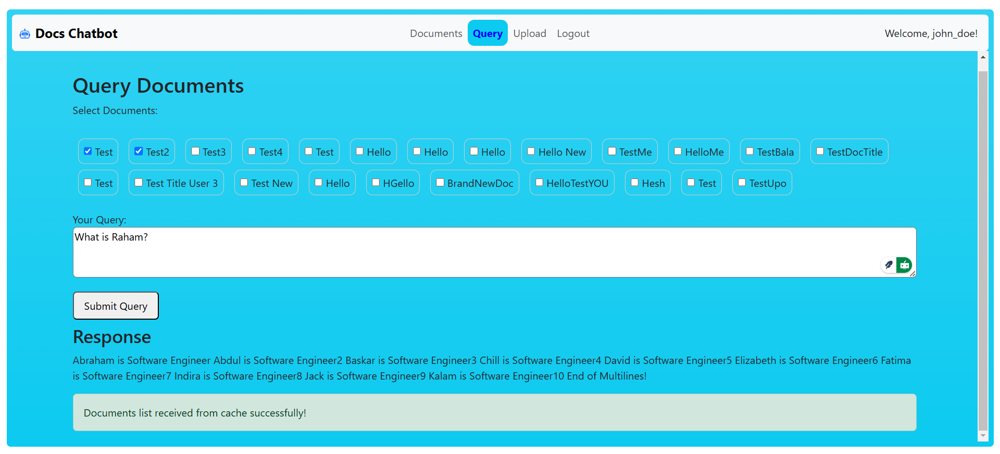
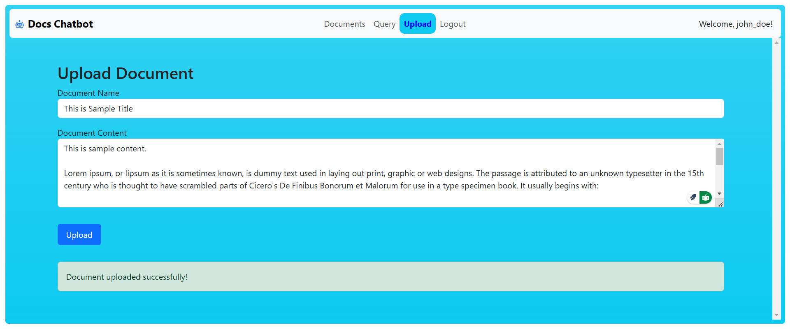
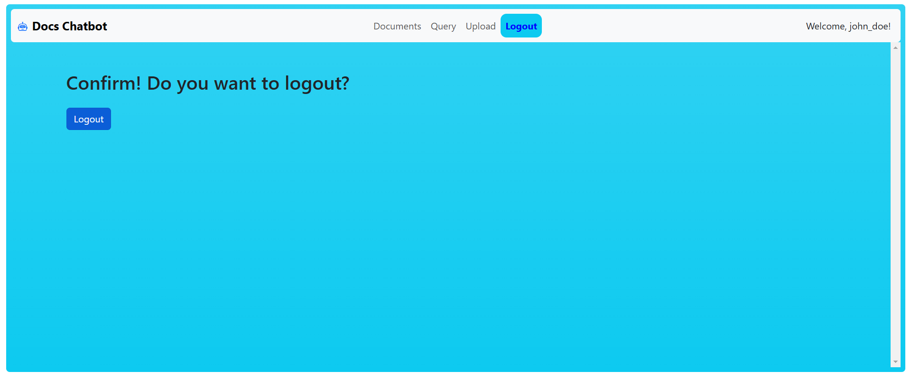

# Frontend for Docs Chatbot

## What is this project about?
* This is a simple chatbot frontend

## Which boilerplate is used?
This project was generated with [Angular CLI](https://github.com/angular/angular-cli) version 17.3.11.

## Summarize, what are the commands to run in order?
* Please run below commands if you are comfortable. Otherwise, please, read the following sections for more detailed steps.
* git clone https://github.com/balasubramaniam-ramasamy/docs-chatbot
* cd frontend (if not already in this directory)
* npm install -g @angular/cli@17.0.0
* npm install
* ng build (optional)
* ng serve

## In what subdirectory, I need to run angular and npm specific commands?
Please run all angular/cli and npm commands of frontend (angular/UI), inside 'frontend' subfolder in your terminal.

## How to clone the project?
* Execute below command to clone or use the below url clone in your style
* git clone https://github.com/balasubramaniam-ramasamy/docs-chatbot

## What IDE is expected to use?
* vscode - Visual Studio Code
* codespace - GitHub CodeSpace

## How to install Angular CLI?
* Angular CLI is required to execute 'ng' commands. 
* Open a new or existing terminal window in vscode and run below command to install CLI.
* npm install -g @angular/cli@17.0.0

## Install Project Dependent Package
* Open a new or existing terminal window in vscode.
* Run below command to execute project dependent packages listed in package.json.
* npm install
* In case of any weird errors, check if you have package-lock.json and delete it. Then run again the above command.

## How to build and run?
* Run below commands to build and run
* ng build (optional, just to make sure no errors)
* ng serve
* After running above command, it will provide and prompt you to open an url to open in a browser
* Open the the url - http://localhost:4200/ in case of localhost, or follow the actual link provide in vscode or codespace.
* And now the app will be ready to use!

## Can I run in Codespace?
* Yes, same steps...
* npm install -g @angular/cli@17.0.0
* npm install
* ng build (optional)
* ng serve or npm start

## What is the dependent Node version?
* v20.15.1 / v20.17.0
* Run below command and check your version in case of any weird errors
* node -v

## What is the dependent npm version?
* 10.8.2 / 10.7.0
* Run below command and check your version in case of any weird errors
* npm -v

## localhost:portnumber is valid in Codespaces?
Not really, you need replace the backend references mentioning with localhost to actual domain name.
For Frontend, it will look like this https://ominous-system-r4xjr4w46j7c5q9g-4200.app.github.dev/auth/login

For Nodejs backend instead of localhost:5000 replace with (actual) for e.g., https://ominous-system-r4xjr4w46j7c5q9g-5000.app.github.dev/api-docs/

For FastAPI backend instead of localhost:5000 replace with (actual) for e.g., https://ominous-system-r4xjr4w46j7c5q9g-8000.app.github.dev/docs

Please, note the port number's location - it is before the domain name - github.dev. 

## Can I see the snapshots of the app?
Yes, please refer below images.
1. User Registration

2. User Login

3. List user's document titles and their contents. Also, allow to select the documents to query.

4. Select the document titles and send query to LLM  

5. Upload document - Inputs are: title and content  

6. Logout and confirm logout. 

## What about the remaining sections?
* Please follow below to do more development and testing of this app.

## Development server

Run `ng serve` for a dev server. Navigate to `http://localhost:4200/`. The application will automatically reload if you change any of the source files.

## Code scaffolding

Run `ng generate component component-name` to generate a new component. You can also use `ng generate directive|pipe|service|class|guard|interface|enum|module`.

## Build

Run `ng build` to build the project. The build artifacts will be stored in the `dist/` directory.

## Running unit tests

Run `ng test` to execute the unit tests via [Karma](https://karma-runner.github.io).

## Running end-to-end tests

Run `ng e2e` to execute the end-to-end tests via a platform of your choice. To use this command, you need to first add a package that implements end-to-end testing capabilities.

## Further help

To get more help on the Angular CLI use `ng help` or go check out the [Angular CLI Overview and Command Reference](https://angular.io/cli) page.
